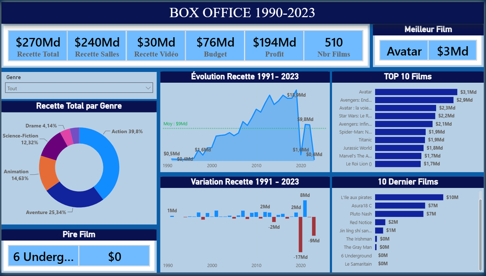

# Analyse Box-Office (Projet Power BI)

> **Projet académique** réalisé dans le cadre de ma formation pour analyser les performances et les tendances du Box-Office mondial.

---

## Aperçu du Tableau de Bord

---

## Objectifs du Projet
L'objectif principal était de concevoir un outil d'aide à la décision interactif permettant de répondre aux questions suivantes :
* Quels sont les genres de films les plus rentables ?
* Quelles sont les tendances d'évolution du marché au fil des années ?
* Quels studios ou acteurs maximisent le retour sur investissement (ROI) ?

## Compétences techniques mises en œuvre
* **Préparation des données (ETL) :** Connexion, nettoyage et transformation des données brutes avec **Power Query**.
* **Modélisation :** Création d'un modèle de données en étoile (relations entre tables de faits et dimensions).
* **Calculs avancés (DAX) :** Création de mesures clés (ex: Chiffre d'affaires cumulé, taux de rentabilité, classements dynamiques).
* **Visualisation (UI/UX) :** Choix de visuels pertinents, mise en place de filtres interactifs (slicers) et respect d'une charte graphique épurée.

## Structure du projet (Format .pbip)
Ce dépôt utilise le format de projet Power BI (`.pbip`), ce qui permet de versionner proprement le code :
* `...BOX_OFFICE.Report` : Contient la configuration visuelle des rapports.
* `...BOX_OFFICE.SemanticModel` : Contient les requêtes Power Query et les mesures DAX.